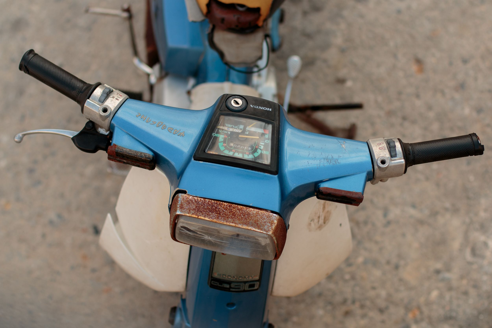

In this mini series I will go over how I used Python to solve a problem that has been bothering my dad for years now. He likes to read his daily paper on his Kindle and has it configured such that it is automatically sent to his device every day, straight from the publisher.

| Item         | Price     | # In stock |
|--------------|-----------|------------|
| Juicy Apples | 1.99      | *7*        |
| Bananas      | **1.89**  | 5234       |

The big issue is this: dad works in remote locations for a bigger part of the year, and more often than not does not have internet access when away from home.  What he does have, though, is satellite email - very barebones and clunky, but it is at least some way to communicate with the outside world.

The email account comes with a measly attachment size limit of 1 MB, which really limits what you can do in terms of sending any regular-sized files such as images or videos. It is so restrictive that even the `.mobi` files containing the daily newspaper can’t get through, because they’re usually around 3-4 MB.

[twojastara?](https://google.com)

~~~js
const getNestedHeadings = (headingElements) => {
  const nestedHeadings = [];

  headingElements.forEach((heading, index) => {
    const { innerText: title, id } = heading;

    if (heading.nodeName === "H2") {
      nestedHeadings.push({ id, title, items: [] });
    } else if (heading.nodeName === "H3" && nestedHeadings.length > 0) {
      nestedHeadings[nestedHeadings.length - 1].items.push({
        id,
        title,
      });
    }
  });

  return nestedHeadings;
};
~~~

For many months the way we dealt with this: I would download the paper manually from the publisher every morning. Then I would use 7zip to split the file into several 1 MB chunks, and send each of them individually to my dad, in their separate emails. Needless to say, this was a massive pain and not the optimal way to do this. There had to be a better way!

And then I thought, I wonder if I can use Python to fully automate this - no more manual splitting and sending, no more remembering to do this every morning and no more missed news for my dad! So that is exactly what I did - read on to find out how (spoiler: it turned out to have much more depth to it than I expected and you need to combine quite a few skills and concepts to make it work smoothly!)

## Creating a custom app in the Dropbox App Console

In this mini series I will go over how I used Python to solve a problem that has been bothering my dad for years now. He likes to read his daily paper on his Kindle and has it configured such that it is automatically sent to his device every day, straight from the publisher.

## Creating a custom API endpoint using Flask

In this mini series I will go over how I used Python to solve a problem that has been bothering my dad for years now. He likes to read his daily paper on his Kindle and has it configured such that it is automatically sent to his device every day, straight from the publisher.

## Deploying the API as a service on a Linux machine

In this mini series I will go over how I used Python to solve a problem that has been bothering my dad for years now. He likes to read his daily paper on his Kindle and has it configured such that it is automatically sent to his device every day, straight from the publisher.

###	Installing and configuring the NGINX web server
###	Obtaining SSL certificates and enabling HTTPS
###	Using the Gunicorn to serve the Flask API

In this mini series I will go over how I used Python to solve a problem that has been bothering my dad for years now. He likes to read his daily paper on his Kindle and has it configured such that it is automatically sent to his device every day, straight from the publisher.

## Securing secrets using Python-Dotenv

In this mini series I will go over how I used Python to solve a problem that has been bothering my dad for years now. He likes to read his daily paper on his Kindle and has it configured such that it is automatically sent to his device every day, straight from the publisher.

## Connecting to the app using the Dropbox Python SDK

In this mini series I will go over how I used Python
